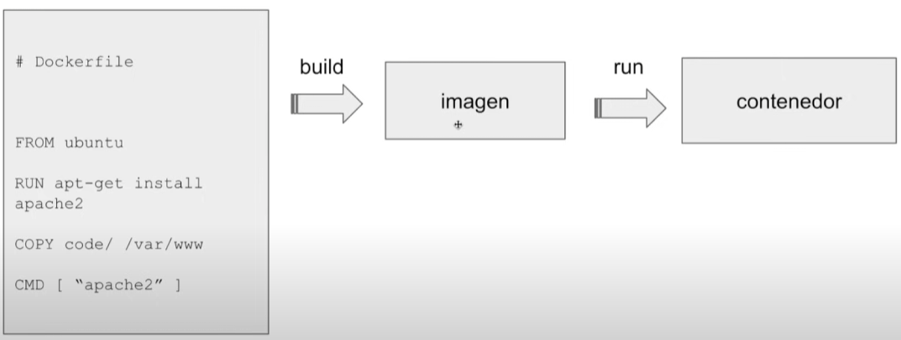
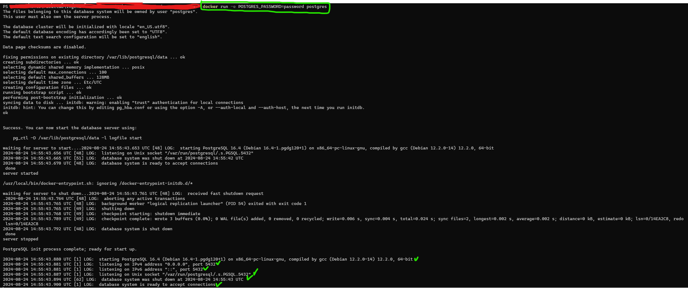
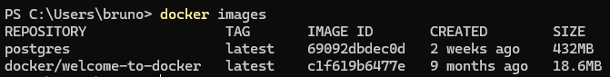
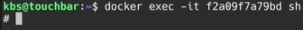
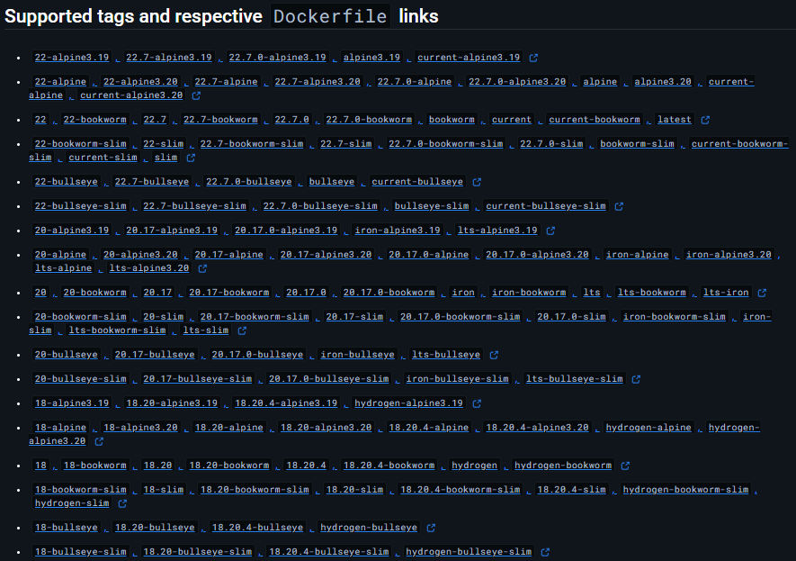
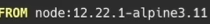
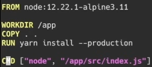
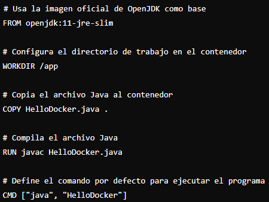
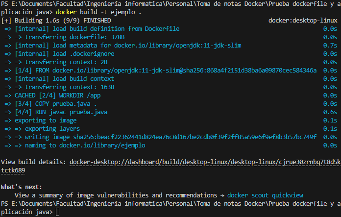
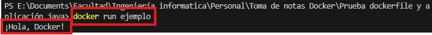

# Docker
## Qué es Docker
La idea de docker es que te permite correr tu aplicación siempre en un mismo entorno. Todas las dependencias de nuestra aplicación van a estar dentro de nuestro contenedor. Al estar en un contenedor podes moverlo de una máquina a otra y siempre esas dependencias necesarias van a estar ahi. De esta manera nos aseguramos de que todo sea como un sandbox.

## Qué diferencia hay entre Docker y una Virtual Machine
Una maquina virtual te permite correr una aplicación junto con tu sistema operativo. Docker lo único que hace es correr esa aplicación con los archivos que necesite. Un contenedor de Linux solo puede correr en un Linux lo mismo para los demas SO. Lo que hace Docker es crear un espacio que nos permita correr esos contenedores en cualquier sistema.

### Docker
Docker te permite correr un contenedor a partir de una imagen, es decir que para correr un contenedor necesitas una imagen. Esa imagen va a tener un sistema operativo corriendo, el software y nuestra aplicación.

Como se genera la imagen? Se genera mediante un archivo *DOCKERFILE*. Este contiene una serie de instrucciones. Despues corremos el comando docker build y para correr el contenedor hacemos un docker run. Lo piola de la imagen es que puede ser coreada por nosotros o por otra persona.

## Registro de Docker
El registro de docker es donde se hostean las imagenes.
https://hub.docker.com/

## Correr una imagen.
Supongamos que queremos correr una imagen de postgres.
Simplemente en consola hacemos: *docker run postgres*. Suponete que postgres no lo tengas instalado no pasa nada, se instala automaticamente. Si lo queres instalar x tu cuenta 
*docker pull postgres* pero en teoria el run ya incluye el pull.
### Tags de las imagenes: 
Son los distintos sabores o vversiones que puede tener una imagen, x lo general se utilizan para especificar la version del SW.

## Comandos mas importantes.
* docker run: Correr una imagen que se convierte en contenedor.
* docker pull: Descargar una imagen.
* docker images: mostrar todas las imagenes que tenemos descargadas. Cada una tiene un ID unico y un tag que acompaña a estas imagenes.

* docker ps: mostrar todos los contenedores que estan corriendo actualmente.(en la consola que corrimos el docker si hacemos ctrl + c lo detenemos.)
* docker ps -a mostrar todos los contenedores que estan corriendo y los q corrieron hace un tiempo. (igual docker tiene un garbage collector)
* docker start CONTAINERID: te permite recuperar o volver a correr un contenedor que no esta corriendo actualmente y ya lo habias ejecutado anteriormente.
* docker logs CONTAINERID
* docker exec: ejecutar un comando dentro de un contenedor q ya esta corriendo, a diferencia de docker run que ejecuta un contenedor nuevo a partir de una imagen. Ejemplo

-i --> crear sesion interactiva
t --> emular terminal
sh --> shell
puedo hacer hasta un ls y ver los archivos del contenedor.
* docker stop CONTAINERID detener contenedor

## Crear una imagen para nuestro contenedor.
Para esto necesitamos un dockerfile
EL Dockerfile siempre empieza con un *FROM*. Cuando nosotros creamos una imagen de docker si o si tenemos que usar una imagen padre q nos permite crear una imagen basado en eso. Si nosotros vamos a usar una aplicacion de node, entonces buscar una imagen de node que ya tenga todas las dependencias que nosotros necesitamos. Lo que tenemos que hacer es ir a dockerhub y buscar la imagen de node por ejemplo, mira todas las imagenes que hay

las que dicen alpine(distri de linux) estan buenas ocupan poco espacio, tienen lo minimo y necesario para correr las apps.
**SIEMPRE** es una buena practica agregarle al from la version de la imagen que vamos a usar.
EJ:
 imagen base 

En el Dockerfile es importante tambien agregarle un directorio de trabajo *WORKDIR*. El comando WORKDIR en un Dockerfile establece el directorio de trabajo dentro del contenedor Docker donde se ejecutarán los comandos subsiguientes. Esto no tiene que ver con el directorio en tu máquina local, sino con el entorno dentro del contenedor.

*COPY . .* Copiar todos los archivos del directorio de trabajo en el contenedor.

*RUN*: compilar todo lo que tenemos dentro de nuestro codigo.

CMD ["" , ""] : siempre es indispesable agregarle al final del dockerfile esto. Es el comando que me va a permitir  correr el programa. Corro el comando de la izquierda y como argumento le paso el de la derecha (el programa que va a correr).

hay otro que se llama ENTRYPOINT creo que es parecido al CMD pero tiene sus diferencias. BUSCAR. 
Ejemplos dockerfile.

Imagen para java:

## Construir un contenedor
Una vez que tenemos nuestro Dockerfile bien configurado, simplemente x consola lo que hacemos es un *docker build .* x consola. Si nostros queremos agregarle un nombre (que es lo que esta bueno) hacemos *docker build -t nombre_que_querramos .*

*ESTA MORTAL ESTO NO HACE FALTA TENER INSTALADO JAVA EN TU MAQUINA LO CORRES DE DOCKER NOMAS EPICO*
Listo, tenemos nuestra imagen constuida de nuestra aplicación, necesitamos ahora correrla. 

## Correr aplicación. 
Bueno simplemente hacemos *docker run nombre_que_le_pusimos* yo en el caso nuestro, le puse *ejemplo* de nombre

Como vemos corrio la aplicación correctamente. si yo hago un docker ps fijate que tendría el contenedor corriendo.

Esta información fue sacada de: 
https://youtu.be/CV_Uf3Dq-EU
